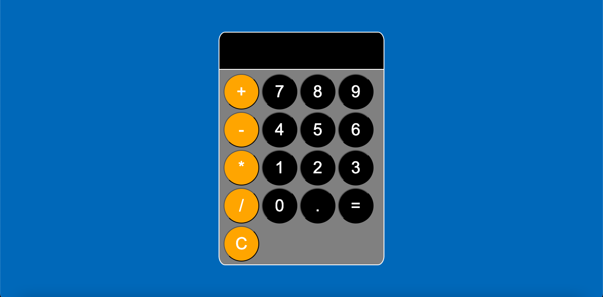
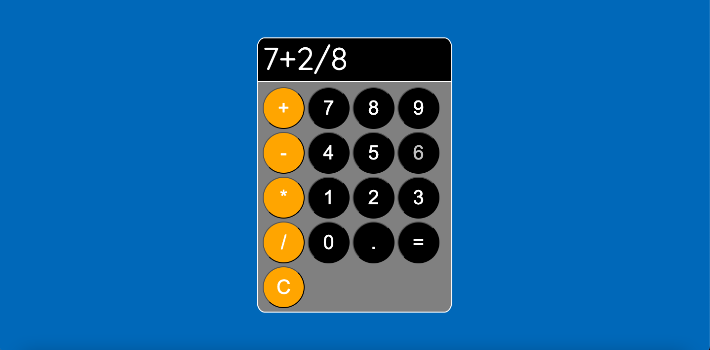

# Calculator

### I made a simple calculator that will pretty much do anything a normal calculator can do such as perform basic calculations, calculate using the previous calculation, and clear the display.

